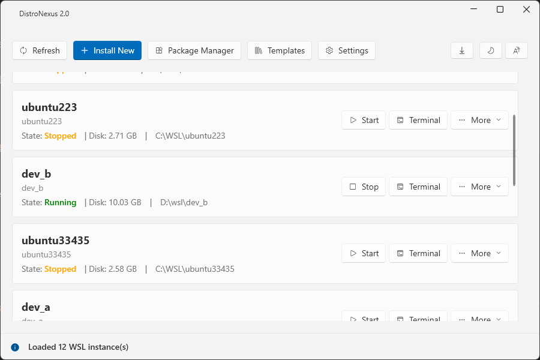
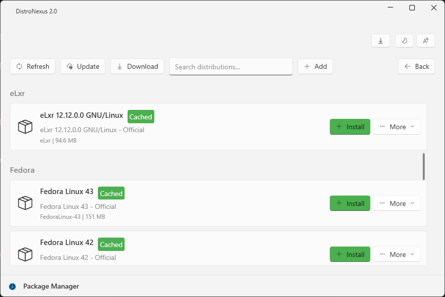
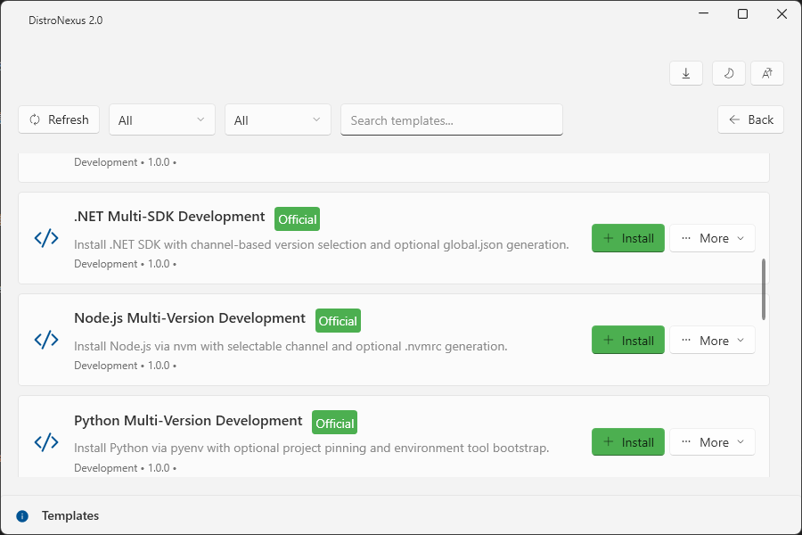

# DistroNexus (发行版枢纽)

**中文** | [English](README.md)

> **当前版本：v2.2.1** — 基于 .NET 10 与 WPF 的原生 Windows 深度 WSL 实例管理体验。

**DistroNexus** 是一个现代化的 Windows 应用程序，用于管理 Windows Subsystem for Linux (WSL) 发行版。采用 .NET 10 和 WPF 构建，提供原生、直观的界面用于下载、安装和管理 WSL 实例。



## 📘 官方文档

完整的文档、使用指南和发布日志请访问我们的官方网站：
👉 **[https://lazyworkshopcreate.github.io/DistroNexus/zh-Hans/](https://lazyworkshopcreate.github.io/DistroNexus/zh-Hans/)**

## ✨ 功能特性

### 实例生命周期与存储

- 启动、停止、刷新、重命名、移动、导入、导出和移除 WSL 实例。
- 使用可配置起始目录在 Windows Terminal 中打开实例。
- 从精选目录源安装发行版到用户指定路径。
- 查看 VHDX 使用情况、启用稀疏模式，并压缩单个或多个 WSL 2 磁盘。
- 设置或重置默认 Linux 凭据。

### 深度实例管理

- 通过实例详情页管理磁盘、资源、集成、网络和备份。
- 编辑 WSL 全局内存、处理器、交换文件、localhost 转发和网络模式设置。
- 查看运行实例的监听端口和 WSL IP 信息。
- 管理受支持 WSL 2 实例的 Docker Desktop 集成。
- 使用标签、筛选、分组和批量选择组织实例。
- 监听外部 WSL 状态变化，无需等待固定缓存超时。

### 备份与恢复

- 通过桌面应用或 PowerShell 导入和导出实例。
- 使用 Windows 任务计划程序创建每日、每周或每月备份计划。
- 执行即时备份、配置保留数量，并查看最近的成功和失败记录。

### 开发体验与自动化

- 基于 Fluent 风格的原生 WPF 界面，支持自动浅色/深色主题。
- 桌面界面和文档支持英文与简体中文。
- 导出 39 个 PowerShell 函数，覆盖生命周期、存储、备份、配置、网络、Docker、标签、目录、模板和发布诊断。
- 16 套内置开发模板，覆盖 .NET、Node.js、Python、Java、Go、Rust、容器、Kubernetes、数据库、AI/ML 和基础设施工具。
- 支持参数化模板执行、环境检查、元数据检查、Dry Run、进度反馈和结构化错误码。
- 支持包下载进度、传输速度、缓存和详细应用日志。



*   **进度与日志**：实时操作进度与详细诊断信息

## 🚀 快速开始

### 需求
- Windows 10 版本 2004 或更新版本，或 Windows 11
- .NET 10 桌面运行时（安装程序已包含）
- WSL2 已启用（用于使用）

### 安装

#### 选项 1：安装程序（推荐）
1. 从 [Releases](https://github.com/LazyWorkshopCreate/DistroNexus/releases) 下载 `DistroNexus-2.2.1-Setup.exe`
2. 运行安装程序
3. 从开始菜单启动

#### 选项 2：便携版
1. 从 [Releases](https://github.com/LazyWorkshopCreate/DistroNexus/releases) 下载 v2.2.1 便携 ZIP 包
2. 解压到任意文件夹
3. 运行 `DistroNexus.Desktop.exe`

#### 选项 3：自包含版（无需 .NET）
1. 从 [Releases](https://github.com/LazyWorkshopCreate/DistroNexus/releases) 下载 v2.2.1 自包含 ZIP 包
2. 解压到任意文件夹
3. 运行 `DistroNexus.Desktop.exe`

## 🛠️ PowerShell 模块

DistroNexus 2.2.1 包含用于自动化的 PowerShell 模块：

```powershell
# 导入模块
Import-Module "C:\Program Files\DistroNexus\PowerShell\DistroNexus.psm1"

# 列出所有实例
Get-DistroNexusInstance

# 安装自定义实例
Install-DistroNexusInstance -DistroName "MyUbuntu" -InstallPath "D:\WSL\MyUbuntu" -Username "admin"

# 启动实例
Start-DistroNexusInstance -DistroName "Ubuntu-22.04"
```

模块按能力分组导出 39 个函数：

- **实例**：列出、安装、启动、停止、移动、重命名、移除、设置凭据、导入和导出。
- **存储与配置**：压缩 VHDX、查看实例配置、管理稀疏模式以及读写 `.wslconfig`。
- **备份与诊断**：管理备份计划、执行备份、查看端口映射和查询实例缓存。
- **集成与组织**：管理 Docker Desktop 集成和实例标签。
- **目录与模板**：浏览/下载软件包、更新目录、发现/应用模板、验证环境与元数据以及执行模板自动化。
- **发布工具**：创建标准化发布证据包。

权威导出列表见 [`src/PowerShell/DistroNexus.psd1`](src/PowerShell/DistroNexus.psd1)。

## 🧩 模板系统



DistroNexus 内置 16 套模板，可将 WSL 实例快速配置为可直接使用的开发环境。

模板系统文档索引：
- 综合说明：`docs/development/template-system-comprehensive-guide.md`
- 需求分析：`docs/specs/template-system-requirements-analysis.md`
- 系统设计：`docs/architecture/template-system-design.md`
- 用户手册：`docs/development/template-system-user-manual.md`
- 模板开发手册：`docs/development/template-development-manual.md`
- 测试套件手册：`docs/development/template-automation-test-suite-manual.md`

- 模板目录文件：`config/templates.json`
- 模板脚本资源：`config/templates/*`
- 主要命令：`Get-DistroNexusTemplate`、`Apply-DistroNexusTemplate`、`Invoke-DistroNexusTemplateAutomation`

### 快速使用

```powershell
# 列出所有模板
Get-DistroNexusTemplate

# 按分类筛选
Get-DistroNexusTemplate -Category "Development"

# 将模板应用到现有 WSL 实例
Apply-DistroNexusTemplate -InstanceName "Ubuntu-22.04" -TemplateId "python-dev" -Verbose

# 应用模板并传入运行时变量
Apply-DistroNexusTemplate -InstanceName "Ubuntu-22.04" -TemplateId "nodejs-dev" -Variables @{ NodeVersion = "20" }
```

### 模板自动化验证

```powershell
# 对指定模板执行 Dry Run
Invoke-DistroNexusTemplateAutomation -Mode SelectedTemplates -TemplateIds "python-dev","nodejs-dev" -Distro "Ubuntu-22.04" -DryRun

# 执行全部模板自动化（建议在受控测试环境中使用）
Invoke-DistroNexusTemplateAutomation -Mode AllTemplates -Distro "Ubuntu-22.04"
```

### 安全提示

- 应用自定义模板时，可能会在目标发行版内执行 Shell 脚本。
- 执行前请先审查模板脚本，尤其是第三方/自定义模板。
- 在可用场景下优先使用 `-WhatIf` / `-Confirm` 进行安全预演。

## ⚙️ 配置

设置存储在 `%APPDATA%\DistroNexus\settings.json`：

```json
{
    "DefaultInstallPath": "C:\\WSL",
    "DefaultWslVersion": 2,
    "DefaultUsername": "root",
    "CatalogUrl": "https://raw.githubusercontent.com/LazyWorkshopCreate/DistroNexus/master/config/catalog.json",
    "Theme": "Auto",
    "EnableLogging": true
}
```

通过应用程序的设置页面配置，或直接编辑 JSON。

## 🏗️ 从源码构建

### 需求
- .NET 10 SDK
- PowerShell 7.0 或更新版本
- Windows 10/11

### 构建步骤

```powershell
# 克隆仓库
git clone https://github.com/LazyWorkshopCreate/DistroNexus.git
cd DistroNexus

# 使用提供的脚本构建
.\tools\build.ps1 -Configuration Release

# 或直接使用 dotnet CLI
dotnet build src/Client/DistroNexus.slnx -c Release
```

### 发布分发

```powershell
# 创建便携 ZIP 包（框架依赖）
.\tools\build.ps1 -Publish -CreateZip -Configuration Release

# 创建自包含包（无需 .NET 运行时）
.\tools\build.ps1 -Publish -SelfContained -CreateZip -Configuration Release

# 构建 Windows 安装程序（需要 Inno Setup）
.\tools\build-installer.ps1 -Version 2.2.1

# 输出将在 release/ 目录中
```

## 📁 项目结构

```
DistroNexus/
├── src/
│   ├── Client/
│   │   ├── DistroNexus.Desktop/          # WPF 应用程序
│   │   │   ├── Views/                    # XAML 视图
│   │   │   ├── ViewModels/               # ViewModels (MVVM)
│   │   │   ├── Converters/               # 值转换器
│   │   │   ├── Resources/                # 图像、图标
│   │   │   └── App.xaml                  # 应用入口
│   │   ├── DistroNexus.Core/             # 核心库
│   │   │   ├── Services/                 # 服务实现
│   │   │   ├── Models/                   # 数据模型
│   │   │   └── Interfaces/               # 服务接口
│   │   └── DistroNexus.Tests/            # 单元测试
│   └── PowerShell/
│       ├── Public/                       # 公开 PowerShell 函数
│       ├── Private/                      # 内部工具函数
│       ├── DistroNexus.psd1              # 模块清单
│       └── DistroNexus.psm1              # 模块脚本
├── config/
│   ├── catalog.json                      # 发行版目录
│   ├── templates.json                    # 模板元数据
│   └── templates/                        # 模板脚本资源
├── docs/                                 # 需求、架构、指南和发布说明
│   ├── release_notes/                    # 版本发布说明
│   └── archive/                          # 历史文档和 v1 比对
├── tools/
│   ├── build.ps1                         # 构建自动化
│   ├── build-installer.ps1               # 安装程序构建器
│   ├── package-portable.ps1              # 便携包创建器
│   └── installer.iss                     # Inno Setup 安装器定义
├── tests/
│   └── PowerShell/                       # Pester 单元和集成测试
├── website/                              # Docusaurus 文档网站
├── README.md                             # 英文文档
└── README_CN.md                          # 中文文档
```

## 🔍 故障排查

### 应用程序无法启动
- 确保安装了 .NET 10 桌面运行时
- 检查 `%APPDATA%\DistroNexus\logs\` 中的错误信息
- 尝试以管理员身份运行

### PowerShell 模块相关问题
```powershell
# 验证模块路径
Import-Module "C:\Program Files\DistroNexus\PowerShell\DistroNexus.psm1" -Verbose

# 检查模块状态
Get-Module DistroNexus
```

### WSL 实例相关问题
- 验证 WSL2 状态：`wsl --status`
- 检查 WSL 版本：`wsl --list --verbose`
- 更新 WSL：`wsl --update`

## 🤝 贡献

欢迎贡献！请直接在 GitHub 提交 Issue 或 Pull Request。

1. Fork 仓库
2. 创建功能分支（`git checkout -b feature/amazing-feature`）
3. 提交改动（`git commit -m 'feat: add amazing feature'`）
4. 推送分支（`git push origin feature/amazing-feature`）
5. 创建 Pull Request

## 📄 许可证

本项目采用 MIT 许可证。详见 [LICENSE](LICENSE) 文件。

## 🙏 致谢

- [WPF-UI](https://github.com/lepoco/wpfui) - 现代 Fluent Design 控件
- [CommunityToolkit.Mvvm](https://github.com/CommunityToolkit/dotnet) - MVVM 基础设施
- Microsoft WSL Team - 推动 Linux on Windows 生态发展

## 📞 支持

- 📖 [文档](https://lazyworkshopcreate.github.io/DistroNexus/)
- 🐛 [问题反馈](https://github.com/LazyWorkshopCreate/DistroNexus/issues)
- 💬 [讨论区](https://github.com/LazyWorkshopCreate/DistroNexus/discussions)

---

**DistroNexus v2.2.1** — 在 Windows 上管理、自动化、保护并定制 WSL 环境。
