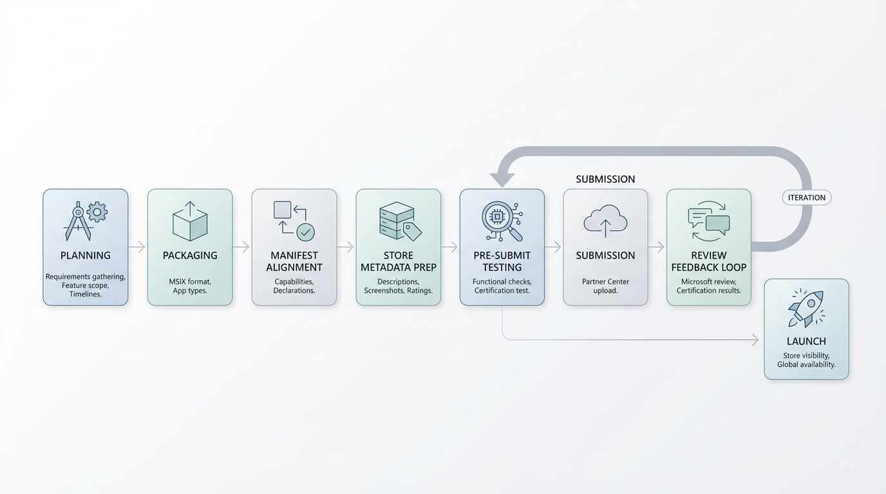

# DistroNexus 成功上架 Windows 应用商店：从 0 到上线全复盘

做完产品只是第一步，把它放到用户能找到的地方才算真正交付。

近期，DistroNexus 正式通过微软认证，上架 Windows 应用商店（Microsoft Store）。用户现在可以在商店搜索"DistroNexus"直接安装，也可以通过以下链接访问：

👉 **[Microsoft Store - DistroNexus](https://apps.microsoft.com/detail/9mtk4br3v436?hl=zh-CN&gl=CN)**

这篇文章完整复盘从决定上架到通过认证的全过程，包括工程改造、提交流程、审核踩坑和可复用的经验清单——如果你也在考虑把自己的桌面应用上架商店，这篇文章应该能帮你少走一些弯路。

---

## 一、DistroNexus 是什么

DistroNexus 是一款 Windows 桌面应用，用于管理 Windows Subsystem for Linux（WSL）发行版。基于 .NET 10 + WPF 构建，提供原生 Windows 体验。

它解决的核心问题是：**WSL 发行版管理碎片化、开发环境搭建重复且不可复现**。

主要能力包括：
- **实例管理**：启动/停止/迁移/重命名/移除，统一可视化操作；
- **模板系统**：15 套内置模板，覆盖 .NET、Node.js、Python、Docker、Kubernetes 等主流开发场景，一键初始化环境；
- **PowerShell 自动化**：15 个 Cmdlet，支持脚本化和 CI 集成；
- **双语支持**：英文 + 简体中文，UI 和文档全覆盖。

---

## 二、为什么要上架 Windows 应用商店

在 GitHub Releases 已经能下载的前提下，为什么还要走商店？

**对用户来说：**
- **信任成本更低**：商店应用经过微软认证审核，用户不需要判断"这个 exe 安全吗"；
- **安装体验更好**：一键安装，不需要手动解压或处理依赖；
- **更新更省心**：商店自动推送更新，用户无需手动下载新版本。

**对团队来说：**
- **分发渠道标准化**：不再只依赖 GitHub 单一渠道；
- **版本治理更可控**：商店有明确的版本号规范和发布节奏；
- **可发现性**：用户可以在商店中搜索到 DistroNexus，带来自然流量。

---

## 三、上架前我们做了哪些准备

### 1）确定渠道策略：双轨并行

我们没有把所有分发方式合并到商店，而是保持"商店 + 独立分发"双轨并行：
- **商店渠道**：`.msixbundle` / `.msixupload`，走 Partner Center 提交；
- **独立渠道**：保留原有的 `.zip` 便携版、Inno Setup 安装版、Self-contained 独立版，继续通过 GitHub Releases 分发。

这样做的好处是：商店渠道的合规要求不会影响独立渠道的灵活性，两条线互不干扰。

### 2）准备提交材料

商店提交需要准备的材料比想象中多：
- **商店描述**：长描述（≤ 10,000 字符）+ 短描述（≤ 270 字符），中英文各一套；
- **视觉素材**：桌面截图（≥ 1366×768）至少 1 张、300×300 应用磁贴图标、44×44 任务栏图标；
- **隐私政策**：必须有一个可访问的隐私政策 URL；
- **分类与关键词**：Utilities & tools > Developer tools；
- **联系方式**：支持邮箱和 GitHub Issues 链接。

**提前准备好这些材料是减少提交返工的关键。**

---

## 四、工程改造：怎么从"能跑"到"能上架"

*图：DistroNexus 上架 Windows 应用商店的实施流程（AI 生成示意图）*

### 阶段 1：引入商店打包项目

新增 `DistroNexus.Package.wapproj`（Windows Application Packaging Project）作为商店包装器。核心改动：

- `Package.appxmanifest` 中写入 Partner Center 分配的身份信息（PFN、Publisher 等）；
- 声明 `runFullTrust` 受限能力，因为 DistroNexus 需要调用 PowerShell 和 WSL 进程；
- 目标平台设置为 `Windows.Desktop`，最低版本 `10.0.19041.0`。

### 阶段 2：改造构建脚本

修改 `tools/build.ps1`，增加 `-StoreBuild` 参数：
- 输出 `.msixbundle`（x64 + ARM64 双架构）；
- 优先生成 `.msixupload`（微软官方推荐的提交格式）；
- 商店构建路径与独立构建路径完全隔离，互不影响。

### 阶段 3：路径兼容性处理

商店应用安装在只读的 `C:\Program Files\WindowsApps\` 下，这意味着：
- 所有需要写入的路径（日志、配置）必须重定向到 `%APPDATA%\DistroNexus\`；
- PowerShell 模块、模板文件等资源的加载路径需要相对于包安装位置解析，不能硬编码。

好消息是，Desktop Bridge（桌面桥）的 Full Trust 应用并不会被 UWP 沙箱虚拟化——`AppData` 和注册表写入都是真实位置，这降低了迁移复杂度。

### 阶段 4：版本号规范对齐

商店要求四位版本号（`Major.Minor.Patch.Revision`），且**第四位必须为 `0`**，由商店系统保留使用。我们调整了 CI 脚本，统一使用 `Major.Minor.Patch.0` 格式，每次提交只递增前三位。

---

## 五、认证审核：最大的卡点在哪里

### `runFullTrust` 权限：审核的重点关注对象

DistroNexus 需要调用底层 PowerShell 和 WSL 进程，必须申请 `runFullTrust` 受限能力。这个能力会触发微软更严格的人工审核。

**通过的关键：**
- 在 Partner Center 的"提交选项"中，提供详尽的业务合理性说明（Justification），解释为什么必须使用 Full Trust；
- 附带完整的测试步骤，包括 WSL 前置环境要求、功能验证路径；
- 用审核员能理解的语言写，降低沟通成本。

### 政策 10.2.5：更新行为合规

我们遇到的另一个审核卡点是 **Microsoft Store Policy 10.2.5**——商店应用不得通过非商店途径安装或更新自身。

这意味着：
- 商店版本必须禁用应用内的"检查更新"功能；
- 不能有任何引导用户去 GitHub 下载新版本的提示；
- 更新只能通过商店自动推送。

我们的解决方案是引入 `StoreComplianceMode`——在运行时检测是否为商店分发，如果是，则自动跳过所有更新检查逻辑，并在日志中记录合规信息。独立渠道不受影响。

---

## 六、踩坑复盘：三个真实的坑

### 坑 1：MSIX 运行时的路径陷阱

**问题**：开发时用的相对路径在独立版本中运行正常，但商店版本安装到 `WindowsApps` 只读目录后，写入操作直接报错。

**根因**：商店应用的工作目录和安装目录与独立版本不同，直接用相对路径会指向只读位置。

**解决**：统一使用 `Environment.GetFolderPath` 获取 `AppData` 路径，将所有可写资源（日志、配置、缓存）重定向到用户目录。

**预防建议**：从项目初期就区分"只读资源路径"和"可写数据路径"，不要等到上架时才改。

### 坑 2：版本号的潜规则

**问题**：第一次提交时版本号用了三位（`2.0.1`），Partner Center 要求四位；改成 `2.0.1.1` 后，又因为第四位不为 `0` 被拒。

**根因**：商店的版本号规范是 `Major.Minor.Patch.0`，第四位由系统保留。

**解决**：调整构建脚本，硬编码第四位为 `0`，并在 CI 中加入版本号格式校验。

**预防建议**：一开始就读清 Partner Center 的版本号文档，不要试出来。

### 坑 3：视觉素材的严苛要求

**问题**：准备了截图但尺寸不对（不满足 ≥ 1366×768），磁贴图标缺少 300×300 和 44×44 规格。

**根因**：商店对每种资产都有严格的尺寸和格式要求，在提交页面才发现就会反复返工。

**解决**：提前整理完整的素材清单，用脚本批量生成所有需要的尺寸变体。

**预防建议**：在开始准备提交之前，先把 Partner Center 的素材要求导出成一份清单，按清单准备。

---

## 七、上线之后

商店页面上线后，我们建议重点关注以下指标：
- **页面访问量与安装转化率**：衡量商店渠道的获客效率；
- **用户评价与反馈**：商店评价是公开的，质量问题会直接影响信任度；
- **崩溃报告**：Partner Center 提供的遥测数据可以帮助发现商店版本特有的问题。

接下来我们计划：
1. 持续优化商店 listing 的描述和截图，提升转化率；
2. 根据用户反馈迭代功能，保持稳定的商店更新节奏；
3. 探索商店推广能力，扩大自然流量。

---

## 八、上架检查清单（可收藏）

如果你也准备上架 Windows 应用商店，以下是我们总结的最小可行清单：

**工程准备**
- [ ] 创建 `.wapproj` 打包项目，绑定 Partner Center 身份
- [ ] `Package.appxmanifest` 声明所需能力（如 `runFullTrust`）
- [ ] 构建脚本支持商店包输出（`.msixbundle` / `.msixupload`）
- [ ] 可写路径全部重定向到 `AppData`，不依赖安装目录写入
- [ ] 版本号统一为 `Major.Minor.Patch.0` 格式

**提交材料**
- [ ] 长描述 + 短描述（中英文各一套）
- [ ] 桌面截图至少 1 张（≥ 1366×768，PNG）
- [ ] 300×300 磁贴图标 + 44×44 任务栏图标
- [ ] 隐私政策 URL 可访问
- [ ] 分类和关键词已填写
- [ ] 支持邮箱和支持 URL 已填写

**认证合规**
- [ ] 受限能力（如 `runFullTrust`）提供了详尽的 Justification
- [ ] 商店版本已禁用应用内更新检查（Policy 10.2.5）
- [ ] Windows App Certification Kit (WACK) 本地预检通过
- [ ] 本地 Sideloading 安装/升级/卸载验证通过

**发布运营**
- [ ] 回滚预案就绪（保留每次提交的包和清单快照）
- [ ] 热修复流程明确（递增版本号重新提交）
- [ ] 监控 Partner Center 遥测数据和用户评价

---

## 相关链接

- **商店地址**：[Microsoft Store - DistroNexus](https://apps.microsoft.com/detail/9mtk4br3v436?hl=zh-CN&gl=CN)
- **GitHub**：[github.com/LazyWorkshopCreate/DistroNexus](https://github.com/LazyWorkshopCreate/DistroNexus)
- **文档站**：[lazyworkshopcreate.github.io/DistroNexus](https://lazyworkshopcreate.github.io/DistroNexus/)
- **隐私政策**：[Privacy Policy](https://lazyworkshopcreate.github.io/DistroNexus/docs/privacy-policy)

---

## 最后

把一个桌面应用从"能用"推到"在商店里能搜到"，中间的工程量和细节量比预期多不少。但走通一次之后，后续版本的更新提交就是一条成熟的流水线了。

如果你正在做 Windows 桌面应用，考虑上架商店是值得的——不是因为商店流量有多大，而是因为它给用户提供了一个**可信的、低门槛的获取途径**。

欢迎下载体验 DistroNexus，也欢迎通过 [GitHub Issues](https://github.com/LazyWorkshopCreate/DistroNexus/issues) 告诉我们你的想法。

如果这篇文章对你有帮助，欢迎转发给同样在折腾 Windows 开发工具分发的朋友。🙏
