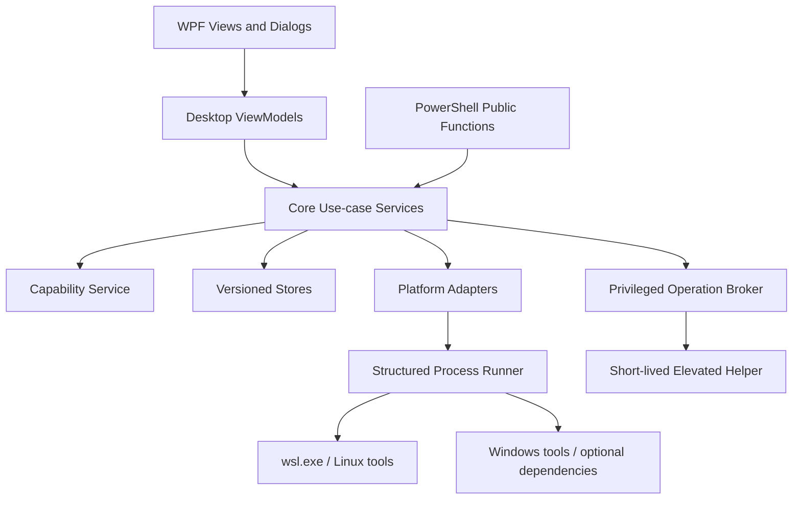

# DistroNexus v2.3.0 Technical Design

**Version**: 2.3.0
**Date**: 2026-07-11
**Status**: Proposed
**Branch**: `feature/2.3.0`
**Requirements**: [v2.3.0-requirements.md](v2.3.0-requirements.md)
**Baseline commit**: `026fcfbea6c8d99492b44fdcba3433041fa7e1fa`

---

## 1. Design Summary

v2.3.0 extends the existing .NET 10/WPF application through the current Core service and MVVM boundaries. It does not introduce a second application process for ordinary work, a database, a web backend, or an in-process shell. New functionality is organized around three shared foundations:

1. **Capability-driven behavior**: every optional or version-sensitive feature consumes one typed capability snapshot.
2. **Safe execution**: Windows and WSL commands use structured arguments, bounded output, cancellation, timeouts, redaction, and explicit elevation.
3. **Versioned durable state**: new application-owned JSON stores use atomic writes, schema versions, deterministic migrations, and read-only fallback for newer schemas.

Feature services remain independent adapters behind Core interfaces. The desktop owns presentation and user confirmation; Core owns validation, orchestration, persistence, and typed failures. The PowerShell module calls the same Core-compatible command contracts where practical and does not become a second implementation of product rules.

The broad release is delivered in dependency order. Capability detection, safe execution, persistence, and configuration parsing are completed before feature-specific UI. Each feature group remains disabled until its capability and acceptance gates pass.

---

## Scope and Requirement Traceability

### Project Roots and Constraints

- Production: `src/Client/DistroNexus.Core`, `src/Client/DistroNexus.Desktop`, `src/PowerShell`.
- Tests: `src/Client/DistroNexus.Tests`, `tests/PowerShell`.
- Configuration and templates: `config`.
- Existing architecture: constructor-injected Core services, WPF MVVM, transient page/view models, singleton host services, `IWslCliRunner`, targeted PowerShell use, resource-based localization, and structured `DistroNexusErrorCode` exceptions.
- Compatibility boundary: settings, tags, backup schedules, templates, and instance registrations from v2.2.1 must remain readable. WSL 1 remains manageable but receives explicit unsupported states for WSL 2-only capabilities.
- Exclusions: all non-goals in requirements Section 3, ratings/comments, package installation through WSLg management, container mutation beyond stated service/socket control, and any silent elevation or external deployment.

### Traceability Matrix

| Requirement | Design section | Test or verification |
|---|---|---|
| UX-01–UX-12 | 4, 5, 8, 9 | capability-state UI tests; confirmation, localization, cancellation, and error-format tests |
| A-01–A-09 | 4.1 | capability probe unit fixtures and supported/outdated/absent runtime matrix |
| B-01–B-16 | 6.1 | health rule fixtures, repair idempotency tests, redaction snapshot tests |
| C-01–C-10 and global configuration list | 4.3, 6.2 | lossless INI round-trip, validation, backup, and restart-impact tests |
| D-01–D-09 | 6.3 | systemd parser/command tests and opt-in disposable-unit acceptance |
| E-01–E-09 | 6.4 | connectivity classifier fixtures and opt-in network/firewall acceptance |
| F-01–F-10 | 6.5, 7.2 | recovery manifest, checksum, rollback, cancellation, and restore acceptance |
| G-01–G-09 | 6.6 | usbipd version fixtures and opt-in physical-device acceptance |
| H-01–H-09 | 6.7 | telemetry parser, bounded polling, cancellation, and tolerance tests |
| I-01–I-10 | 6.8, 7.3 | workspace schema, trust transition, action graph, and launcher tests |
| J-01–J-07 | 6.9 | desktop-entry parser security corpus and opt-in WSLg launch acceptance |
| K-01–K-08 | 6.10 | runtime-adapter contract tests and Docker/Podman environment matrix |
| L-01–L-13 | 6.11, 7.4 | catalog/manifest schema, trust, checksum/signature, diff, and rollback tests |
| SEC-01–SEC-08 | 4.2, 8 | injection, traversal, elevation-boundary, redaction, and atomic-write tests |
| Persistence and automation | 7, 10 | migration fixtures, newer-schema read-only tests, PowerShell contract tests |
| Release gates | 11, 12 | build/test evidence plus documented external compatibility matrix |

### Evidence Classification

| Question | Source | Finding | Classification |
|---|---|---|---|
| Can Core own new behavior? | `DistroNexus.Core/Interfaces` and `Services` | Existing features already use injected service interfaces. | Confirmed |
| Can instance UI grow incrementally? | `InstanceDetailViewModel` and `ViewModels/Tabs` | Five lazily initialized tab view models already exist. | Confirmed |
| How are commands executed? | `IWslCliRunner`, `PowerShellService` | WSL CLI is abstracted, but its current string argument contract is insufficient for new untrusted inputs. | Confirmed |
| How is local state stored? | `SettingsService`, `BackupService`, `TemplateService`, `TagService` | JSON files under `%APPDATA%\DistroNexus` exist, but writes are not uniformly atomic or schema-versioned. | Confirmed |
| Are typed failures established? | `DistroNexusErrorCode` and exception types | Numeric categories and UI formatting already exist. | Confirmed |
| Are optional runtime features stable across machines? | Requirements references and WSL CLI dependency | Behavior varies by Windows, WSL, distribution, dependency, and privilege state. | Confirmed; runtime acceptance required |

---

## Architecture and Ownership

## 2. Layered Architecture



### 2.1 Desktop

Desktop responsibilities:

- navigation, presentation state, localization, confirmation, file/folder pickers, and progress rendering;
- tab visibility and enabled state derived from capability snapshots;
- cancellation token ownership for page/dialog lifetime;
- no direct file mutation, `Process.Start` command construction, registry access, or business validation.

New top-level view models are `HealthCenterViewModel`, `DevicesViewModel`, and `WorkspacesViewModel`. `InstanceDetailViewModel` gains `ConfigurationTabViewModel`, `ServicesTabViewModel`, `MonitorTabViewModel`, `ApplicationsTabViewModel`, and a generalized `ContainerRuntimesTabViewModel`. Tabs are created through an `IInstanceDetailTabFactory` so the parent constructor does not grow indefinitely. Tabs retain lazy initialization and implement `IAsyncDisposable` when they own polling.

### 2.2 Core

Core owns use cases and contracts. Services are grouped by capability rather than by UI page:

- foundation: capabilities, process execution, persistence, validation, redaction, privileged operations;
- host/instance configuration and health;
- systemd, network, recovery, USB, monitoring, workspaces, WSLg, container runtimes, and marketplace;
- existing lifecycle, backup, tags, templates, and Docker services migrate incrementally onto shared foundations.

Interfaces return immutable records or read-only collections. Public service methods accept `CancellationToken`; operations longer than one second accept `IProgress<OperationProgress>` where progress is meaningful.

### 2.3 Platform Adapters

Adapters encapsulate unstable external formats and are independently fixture-tested:

- `IWslCommandAdapter`
- `ISystemdAdapter`
- `INetworkDiagnosticsAdapter`
- `IUsbIpdAdapter`
- `IProcessTelemetryAdapter`
- `IDesktopEntryAdapter`
- `IContainerRuntimeAdapter`
- `IWindowsFeatureAdapter`
- `IFirewallAdapter`

Adapters parse external output into typed records and never expose raw strings as product state. Raw stdout/stderr is retained only in bounded, redacted diagnostic details.

### 2.4 Composition and Lifetimes

- Stateless adapters and durable stores: singleton.
- Services with internal concurrency controls: singleton.
- Page/dialog view models: transient.
- Polling sessions: explicit disposable objects created per visible monitor tab.
- Capability snapshots: immutable; host cache is singleton-owned, instance snapshot is keyed case-insensitively by registered instance name.

No service constructor performs external probes. Initialization is explicit and cancellable, preventing optional dependency failure from blocking application startup.

## 3. End-to-End Flows

### 3.1 Read Flow

1. View model requests a capability snapshot.
2. Capability service returns cached stable probes and refreshes expired volatile probes.
3. View model renders supported, unsupported, unavailable, update-required, elevation-required, or unknown state.
4. On user navigation, the relevant service loads typed state through an adapter/store.
5. External parsing errors become typed degraded state; unrelated surfaces remain available.

### 3.2 Mutation Flow

1. Desktop requests an immutable `OperationPreview` from Core.
2. Preview describes affected files, instances, commands/actions, restart impact, privilege, reversibility, and estimated duration/space.
3. Desktop obtains explicit confirmation when policy requires it.
4. Core revalidates capability and preconditions to prevent time-of-check/time-of-use drift.
5. Core creates backups or recovery metadata, executes through adapters, and reports phases.
6. Core verifies postconditions before committing durable state.
7. Failure invokes feature-specific compensation, records a structured operation result, and preserves diagnostic evidence.
8. Capability and affected data caches are invalidated.

---

## 4. Shared Foundations

### 4.1 Capability Model

```csharp
public enum CapabilityStatus
{
    Supported,
    Unsupported,
    Unavailable,
    RequiresUpdate,
    RequiresElevation,
    Unknown
}

public sealed record CapabilityResult(
    CapabilityId Id,
    CapabilityStatus Status,
    string ReasonCode,
    Version? DetectedVersion = null,
    Version? MinimumVersion = null,
    RestartScope RestartScope = RestartScope.None,
    DateTimeOffset CheckedAt = default,
    IReadOnlyDictionary<string, string>? Evidence = null);
```

`ReasonCode` is a stable localization key, not localized text. Evidence is allow-listed and redacted. `PlatformCapabilitySnapshot` contains host facts, dependency facts, and per-instance capabilities.

Probe order is authoritative CLI/API, then registry/file presence, then version matrix. Windows build alone never produces `Supported` when a runtime probe exists. Stable host probes cache for the process lifetime; dependency probes cache for five minutes; instance state/systemd probes cache for 15 seconds. Explicit refresh bypasses caches. Settings writes, WSL updates, instance changes, and dependency operations invalidate relevant keys.

Concurrent callers for the same probe share one in-flight task. Failure uses a short 10-second negative cache to avoid process storms and returns `Unknown` unless absence was authoritative.

### 4.2 Structured Process Execution

The string-based `IWslCliRunner.RunAsync(string)` is retained temporarily for compatibility and marked obsolete after consumers migrate. New code uses:

```csharp
public sealed record ProcessRequest(
    string FileName,
    IReadOnlyList<string> Arguments,
    TimeSpan Timeout,
    string? WorkingDirectory = null,
    IReadOnlyDictionary<string, string?>? Environment = null,
    ProcessOutputMode OutputMode = ProcessOutputMode.Text,
    int MaxCapturedBytes = 1_048_576);

public interface IProcessRunner
{
    Task<ProcessResult> RunAsync(ProcessRequest request, CancellationToken cancellationToken);
}
```

Arguments populate `ProcessStartInfo.ArgumentList`; `UseShellExecute` is false for non-elevated execution. Cancellation kills the process tree and awaits exit. Timeout and cancellation are distinct results. Output capture is bounded, records truncation, supports explicit UTF-8/UTF-16 selection, and never logs full commands until arguments pass a redaction policy.

Linux commands execute as `wsl.exe --distribution <name> --exec <binary> <arguments...>`. Shell execution is allowed only for an explicitly reviewed script asset or trusted workspace command and is represented by a separate `ShellScriptRequest`, never by concatenating user input.

### 4.3 Lossless Configuration Documents

Replace line-specific configuration mutation with `ILosslessIniDocument`:

- tokenizes blank lines, comments, section headers, key/value records, malformed lines, line endings, and original key casing;
- exposes typed projections for `.wslconfig` and `/etc/wsl.conf`;
- updates only targeted keys and preserves all other tokens byte-for-byte where encoding permits;
- validates typed fields against a capability-aware schema registry;
- writes to a sibling temporary file, flushes, creates a timestamped backup, then atomically replaces the target.

For `/etc/wsl.conf`, Core writes content to a Windows temporary file and invokes a bundled, fixed Linux helper script with structured arguments. The helper validates the target is exactly `/etc/wsl.conf`, creates a root-owned backup, writes a temporary file in `/etc`, applies mode `0644`, fsyncs, and renames. It never accepts an arbitrary target path.

### 4.4 Versioned Store

```csharp
public interface IVersionedJsonStore<TDocument>
{
    Task<StoreReadResult<TDocument>> ReadAsync(CancellationToken cancellationToken);
    Task WriteAsync(TDocument document, long expectedRevision, CancellationToken cancellationToken);
}
```

Documents contain `schemaVersion`, `revision`, and `updatedAt`. Writes are serialized per file with `SemaphoreSlim`, use optimistic revision checks, serialize to a temporary sibling, flush, and atomically replace while retaining one `.bak`. Unsupported newer schemas return read-only state. Migrations are pure, ordered, idempotent functions over JSON documents and are tested from every supported prior version.

Existing unversioned files are treated as schema version 1 and upgraded on the first successful mutation, not merely on read. `settings.json` remains owned by `SettingsService`; tags continue to coexist during v2.3.0, but all writers must use one shared settings mutation lock to eliminate lost updates.

### 4.5 Operation Model

Long-running and mutating services use:

- `OperationPreview`: impact, capability requirements, affected resources, elevation, restart scope, reversibility, estimated size/time, and warnings;
- `OperationProgress`: operation ID, phase ID, localized message key, optional percent, and current item;
- `OperationResult<T>`: operation ID, outcome, value, warnings, diagnostic reference, and compensation result;
- `OperationOutcome`: succeeded, partially succeeded, cancelled, failed, or compensation failed.

Operation IDs are random GUIDs used for log correlation, not telemetry. Results containing command lines are redacted before persistence.

---

## Contracts and Behavior

## 5. Cross-Cutting Contracts

### 5.1 Validation

Validation is centralized in Core and repeated immediately before mutation:

- instance name must exactly match an installed instance for existing-instance operations; new names must pass WSL restrictions and collision checks;
- Windows paths use `Path.GetFullPath`, reject device paths and unexpected reparse traversal for security-sensitive stores, and must remain within the selected root where required;
- Linux paths are absolute or workspace-relative according to contract, reject NUL/newline, and are never interpolated into a shell string;
- systemd unit names use a strict unit-name parser;
- bus IDs, ports, URLs, hashes, manifest IDs, and schema versions use dedicated value objects;
- remote catalogs default to HTTPS and enforce download size, redirect, timeout, and content-type limits.

### 5.2 Authorization and Elevation

The normal desktop process runs unelevated. Privileged Windows operations are limited to a short-lived helper executable shipped and signed with DistroNexus. The helper:

- accepts a versioned JSON request through a named pipe secured to the current user and administrators;
- supports an allow-listed operation enum only: Windows feature enable, usbipd bind/unbind, and narrowly scoped firewall create/remove;
- validates all fields again and rejects arbitrary executable names or command text;
- returns a signed-build-compatible structured result and exits after one request;
- is launched with `runas` only after UI confirmation.

Linux privilege uses `sudo --non-interactive`. DistroNexus never captures a sudo password. If policy denies the action, Core returns `RequiresLinuxPrivilege` with exact manual guidance.

### 5.3 Errors and Compatibility

Extend error-code categories without changing existing values:

- 7xxx: capability, health, and monitoring;
- 8xxx: systemd, network, USB, WSLg, containers, and workspaces;
- retain 4xxx for recovery/export and 6xxx for templates/marketplace;
- 9xxx remains host/system infrastructure.

Every adapter maps absence, unsupported version, permission denial, timeout, cancellation, invalid output, conflict, and operation failure separately. Unknown external output is never interpreted as success.

### 5.4 Audit and Observability

NLog structured events include timestamp, level, error code, operation ID, feature, phase, outcome, elapsed milliseconds, dependency version, and redacted instance identifier where appropriate. The application keeps ordinary rolling logs under the configured log path. It does not introduce telemetry.

Diagnostic reports are assembled from allow-listed providers. Preview shows every section and file. Redaction modes are `Standard` (default), `Minimal`, and `None`; secrets are always redacted regardless of mode. Path and username pseudonyms are stable only within one report.

---

## 6. Feature Designs

### 6.1 Health Center

`IHealthCheck` implementations declare ID, scope, prerequisites, severity policy, and optional repair ID. `HealthOrchestrator` builds a dependency graph, executes independent checks with a maximum concurrency of four, streams findings, and isolates failures per check. Checks are deterministic over typed probe inputs; UI does not interpret raw CLI text.

`IRepairAction` provides `PreviewAsync`, `ExecuteAsync`, idempotency classification, and postcondition verification. Repairs never call one another implicitly. Batch repair is excluded; users approve each disruptive action. Safe navigation actions may run without confirmation, while configuration, shutdown, update, feature, trim, and elevation actions always require it.

Findings are not durable by default. The latest scan summary and repair outcomes may be retained for seven days in `health-history.json`; raw command output is omitted. Diagnostic export is generated on demand and deleted only by the user or normal temporary-file cleanup.

### 6.2 Global and Distribution Configuration

`IWslConfigurationService` replaces the narrow global projection while preserving `IWslConfigService` as a compatibility facade. It returns `ConfigurationDocument<TSettings>` containing typed values, validation messages, unknown-key count, source fingerprint, and restart scope. Save requires the source fingerprint; an external edit produces a conflict and reload prompt rather than overwrite.

Global settings are driven by `WslSettingDefinition` records containing section, key, type, allowed values/range, minimum capability, default, and restart scope. Experimental keys are shown only when recognized by the detected WSL version and remain clearly labeled.

`IDistributionConfigurationService` reads `/etc/wsl.conf` through `wsl.exe --exec cat -- /etc/wsl.conf`, parses locally, and writes through the fixed helper described in 4.3. Default-user changes are validated against `getent passwd`. The service reports `TerminateInstance` or `ShutdownWsl`; Desktop lists affected running instances before confirmation.

### 6.3 systemd Services

`ISystemdService` wraps `systemctl` and `journalctl` through `ISystemdAdapter`. Machine-readable output is preferred: `systemctl show` with explicitly selected properties and stable separators. Service lists are paged/filterable in memory after one bounded query. Journal retrieval defaults to 200 lines, caps at 5,000, and never follows indefinitely.

Mutations accept a `SystemdUnitName` and `SystemdScope` value, execute one allow-listed verb, then requery the unit. User scope sets the correct distribution user explicitly. System scope uses non-interactive sudo only where required. Dependency data is read-only. Failed units feed the health check through the same adapter model.

### 6.4 Networking and Firewall

`INetworkDiagnosticsService` composes independent probes and classifies outcomes as resolved, route missing, refused, timed out, permission denied, or tool unavailable. It uses .NET DNS/TCP APIs for Windows-side tests and fixed Linux helpers (`getent`, `ip`, `/dev/tcp` only through a bundled script when no structured tool exists) for WSL-side tests.

Port ownership extends `PortMapping` with protocol, address family, local address, PID, process name, and origin. Windows collision detection uses managed IP properties and `Get-NetTCPConnection` only through a read-only adapter fallback. Browser launch allows only `http` or `https` and brackets IPv6 addresses.

Firewall management creates DistroNexus-owned rules with a deterministic group and rule ID. Users preview direction, protocol, port, profiles, remote scope, and executable scope. Removal is allowed only for rules carrying the DistroNexus group marker. Existing third-party rules are never edited.

### 6.5 Recovery Points and Clone

`IRecoveryPointService` owns export, manifest, verification, restore, clone, retention, and deletion. A recovery point is a directory containing the payload and `manifest.json`; the manifest is written last so incomplete directories are never considered valid.

```json
{
  "schemaVersion": 1,
  "id": "guid",
  "name": "Before toolchain upgrade",
  "sourceInstance": "Ubuntu-24.04",
  "sourceWslVersion": 2,
  "format": "Tar",
  "createdAt": "2026-07-11T12:00:00Z",
  "payloadFile": "instance.tar",
  "sizeBytes": 0,
  "sha256": "lowercase-hex",
  "applicationVersion": "2.3.0",
  "tags": [],
  "description": ""
}
```

Exports write `*.partial`, stream SHA-256 after completion, rename the payload, then atomically write the manifest. Free-space preflight uses VHDX size or filesystem usage plus a 10% safety margin and remains an estimate. TAR is the default portable format. VHDX is offered only for WSL 2 capability support and includes a warning about consistency and size.

Restore always targets a new instance. Core reserves the name and target directory with an operation marker, imports, verifies registration and boot, and removes only resources tagged with that operation ID on failure. It never unregisters a pre-existing instance. Clone is recovery-point creation followed by restore; import-in-place is used only when the user selects VHDX fast clone and the source is immutable for the duration.

Scheduled backups remain readable. `BackupHistoryEntry` becomes a projection over scheduled artifacts, failure records, and recovery manifests; existing schedule files are not rewritten until changed.

### 6.6 USB Devices

`IUsbDeviceService` uses versioned `IUsbIpdAdapter` parsers. The adapter first attempts JSON output if supported; otherwise it selects an explicit parser by detected major version. Unknown versions may list raw diagnostic state but disable mutation.

Bind/unbind call the elevated broker. Attach/detach run unelevated when supported, otherwise the capability result requests elevation. The service refreshes after mutation and optionally verifies via `lsusb`. Windows device arrival notifications debounce for 500 ms and trigger refresh only while the Devices page is active.

The model represents VM-wide attachment and does not claim per-distribution isolation. Storage-class devices receive a stronger data-loss warning. No automatic driver, usbipd, Linux package, or udev-rule installation occurs.

### 6.7 Monitoring

`IMonitoringService.CreateSession(instance, interval)` returns an `IMonitoringSession` with an asynchronous sample stream. One fixed Linux probe script reads `/proc/stat`, `/proc/meminfo`, `/proc/diskstats`, `/proc/net/dev`, filesystem data, and top processes in one process per interval. CPU and I/O rates are calculated from consecutive samples using monotonic time.

The session owns a bounded ring buffer of 300 samples, supports intervals 1/2/5/10 seconds, coalesces slow ticks instead of overlapping, and stops on tab invisibility, instance stop, dialog close, or application shutdown. Process commands remain memory-only. Host VHDX size is read without starting stopped instances; Linux metrics display unavailable for stopped instances.

Process termination sends `TERM`, waits up to three seconds, and offers a separate confirmed `KILL` action if still running. PID and process start time are revalidated immediately before signaling to avoid PID reuse.

### 6.8 Development Workspaces

`IWorkspaceService` stores versioned definitions in `workspaces.json`. Each definition has stable ID, display name, instance binding, paths, preflight checks, ordered action groups, close policy, trust state, and revision. Imported definitions are always `Untrusted`; local edits to an untrusted definition do not silently trust it.

Actions implement `IWorkspaceActionHandler` and declare type, validation, required capability, preview, execution, rollback availability, and timeout. Supported types are terminal, VS Code, Explorer, browser, Linux command, systemd action, Docker Compose, and Podman Compose. Parallel actions must be in the same explicit group and have no declared dependency; groups execute sequentially. Failure policy is stop, continue, or ask, stored per action.

Arbitrary commands are represented as executable plus argument array whenever possible. An explicit shell command action stores its full script and requires a first-run/import trust confirmation. Shortcut targets invoke DistroNexus with `--workspace <guid>`; no command content is embedded in the shortcut.

### 6.9 WSLg Applications

`IWslgApplicationService` scans allow-listed system and user application directories for `.desktop` files. `DesktopEntryParser` implements the necessary Desktop Entry Specification fields and Exec field-code expansion without invoking a shell. It rejects NUL/newline, remote icon URLs, invalid field codes, Windows executables, and entries that resolve outside the distribution command boundary.

Icons are copied through a bounded cache only from regular files under approved Linux icon roots, with size and image decoding limits. Launch uses parsed executable/arguments through `wsl.exe --exec`. Pinning is DistroNexus-local metadata; Windows Start Menu integration remains the responsibility of WSLg/Windows.

### 6.10 Container Runtime Integrations

```csharp
public interface IContainerRuntimeAdapter
{
    ContainerRuntimeKind Kind { get; }
    Task<ContainerRuntimeStatus> ProbeAsync(string instanceName, CancellationToken ct);
    Task<IReadOnlyList<ContainerSummary>> ListContainersAsync(string instanceName, CancellationToken ct);
    Task<IReadOnlyList<ImageSummary>> ListImagesAsync(string instanceName, CancellationToken ct);
    Task<IReadOnlyList<ComposeProjectSummary>> ListProjectsAsync(string instanceName, CancellationToken ct);
}
```

Docker Desktop configuration remains behind the existing service, adapted into the common status model. Podman probing inside WSL is independent from Podman Desktop discovery on Windows. v2.3.0 lists containers/images/projects read-only. Only Podman user socket/service start and stop are mutating, implemented through the systemd service. Runtime failures are isolated and never affect instance lifecycle.

### 6.11 Trusted Template Marketplace

Marketplace responsibilities are split:

- `ITemplateSourceService`: source CRUD, fetch, caching, and provenance;
- `ITemplateManifestValidator`: schema and capability validation;
- `ITemplateTrustService`: source/publisher decisions and signature policy;
- `ITemplateArtifactStore`: immutable content-addressed artifacts and prior-version retention;
- existing `ITemplateService`: merged discovery and execution after validation/trust.

Catalogs reference immutable artifact URLs and SHA-256 hashes. Artifacts are downloaded to a size-limited temporary file, hashed, optionally signature-verified, unpacked with zip-slip and symlink protections, then moved into a content-addressed cache. Catalog signatures use detached Ed25519 signatures over canonical UTF-8 JSON. Built-in catalogs trust a product-shipped public key. User-added sources are initially untrusted; checksum integrity is mandatory even when signature trust is absent.

Trust is scoped to source URL plus publisher key fingerprint, never display name. An update that changes scripts, requested capabilities, publisher key, or source requires review. The diff is computed against normalized text with size limits. The prior known-good artifact remains until the updated template completes successfully or the user explicitly removes it.

Template manifest schema version 2 adds provenance, publisher, capabilities, health checks, scripts with hashes, compatibility, and artifact version. Version 1 built-in/user templates migrate in memory with conservative inferred capabilities and remain executable under the existing local-template trust policy. Remote version 1 templates cannot execute until imported and reviewed as local content.

---

## Data and Execution Semantics

## 7. Persistence and State

### 7.1 Store Inventory

| Store | Schema | Retention | Owner |
|---|---:|---|---|
| `settings.json` | existing, versioned on next write | until reset | `SettingsService` |
| `backup-schedules.json` | existing, versioned on next write | until schedule removal | `BackupService` |
| `recovery-points.json` or manifests | 1 | while payload exists | `RecoveryPointService` |
| `workspaces.json` | 1 | until user deletion | `WorkspaceService` |
| `template-sources.json` | 1 | until source removal | `TemplateSourceService` |
| `template-trust.json` | 1 | until trust revoked | `TemplateTrustService` |
| content-addressed template cache | hash-addressed | active + previous known-good | `TemplateArtifactStore` |
| `health-history.json` | 1 | seven days, bounded | `HealthOrchestrator` |
| WSLg icon cache | derived | LRU, bounded by size | `WslgApplicationService` |

All application-owned files live below `%APPDATA%\DistroNexus`, except large caches/recovery payloads selected by the user or placed under `%LOCALAPPDATA%` when roaming is inappropriate. Recovery payloads never default to roaming AppData.

### 7.2 Consistency and Concurrency

- Per-file writes are serialized and revision-checked.
- Cross-store operations use durable operation markers, ordered commits, and compensation rather than distributed transactions.
- Recovery manifests commit last; template artifact metadata commits after immutable content; workspace launch history is not required for correctness.
- External source fingerprints prevent configuration lost updates.
- Refresh and polling use single-flight execution and cancellation; no timer callback performs overlapping work.
- Instance names use `StringComparer.OrdinalIgnoreCase`; persisted IDs use GUIDs and survive rename.

### 7.3 Retry Policy

Local deterministic validation, permission denial, malformed output, checksum mismatch, and user cancellation are never retried. Transient read-only probes may retry once with bounded jitter. Mutations are not automatically retried unless the operation has a documented idempotency key and verified precondition. UI exposes explicit retry after showing the prior outcome.

### 7.4 Failure and Recovery

- Atomic-store failure retains the old document and temporary file is cleaned on next startup.
- Configuration failure restores the backup only if fingerprint proves no third-party edit occurred after DistroNexus wrote.
- Recovery import failure removes only operation-owned partial paths/registrations.
- Template update failure retains and reselects prior known-good content.
- Workspace action failure follows its configured policy; successful prior actions are not automatically undone unless their handlers declare a safe compensation.
- Elevated helper failure returns structured output; the unelevated process remains healthy.

---

## Security and Operations

## 8. Threat Model and Controls

Primary trust boundaries are Windows user to elevated helper, Windows host to WSL distribution, local application to optional tools, remote marketplace to local cache, imported workspace to execution, and `.desktop` file to launcher.

| Threat | Control |
|---|---|
| Command injection | `ArgumentList`, typed value objects, fixed helper scripts, no implicit shell |
| Path traversal/symlink escape | canonical roots, archive entry validation, reparse/symlink checks, fixed config targets |
| Privilege escalation | allow-listed short-lived helper, secured pipe, second validation, no arbitrary command field |
| Malicious template | mandatory hash, optional signature trust, capability review, immutable cache, recovery recommendation |
| Malicious workspace import | untrusted state, full preview, first-run approval, shell action distinction |
| Malicious desktop entry | parser without shell, strict field codes, approved icon roots, bounded decoding |
| Secret/log leakage | centralized redaction, bounded output, allow-listed report providers, secrets always removed |
| TOCTOU/PID reuse | revalidation immediately before mutation, source fingerprints, process start-time check |
| Lost configuration updates | revision/fingerprint checks, serialized atomic store |
| Resource exhaustion | process timeouts, output limits, concurrency limits, bounded caches and histories |

The project must produce a threat-model review for the elevated helper, marketplace, workspace commands, and WSLg parser before their implementation slices are accepted.

## 9. UI and Interaction Design

The main navigation adds Health, Devices, and Workspaces. Existing dashboard and package/template pages remain. Instance details use a scrollable tab header when the window cannot show all tabs; tabs are capability-filtered but an unavailable feature remains discoverable through a disabled entry with explanation when that is more useful than hiding it.

Every feature follows four states:

1. loading/probing;
2. available with current state;
3. unavailable with reason and safe next step;
4. operation in progress with cancellation and phase.

`OperationPreviewDialog` is shared by repair, configuration, firewall, recovery, USB, service, process, workspace trust, and marketplace mutations. It renders impact from Core rather than reconstructing it in each view model. Error dialogs retain `[DN-XXXX]`, copy-code behavior, and add a collapsible redacted diagnostic section.

Charts use a lightweight WPF-native control or custom drawing surface selected during the monitoring slice; no embedded browser is introduced. Accessibility requires keyboard navigation, screen-reader labels, high-contrast resources, non-color status indicators, and reduced-motion behavior.

## 10. PowerShell and Public Automation

New functions are thin adapters over Core-compatible services and typed models. Naming uses approved verbs. Read functions return objects by default and optional versioned JSON with `-AsJson`; mutating functions support `ShouldProcess`.

Planned command families:

- `Get-DistroNexusCapability`, `Invoke-DistroNexusHealthScan`, `Repair-DistroNexusHealthFinding`;
- `Get/Set-DistroNexusDistributionConfig` and systemd service commands;
- recovery-point create/get/test/restore/remove and clone;
- USB list/attach/detach, with bind/unbind requiring explicit elevation;
- monitoring snapshot (not continuous chart streaming);
- workspace get/import/export/start;
- WSLg app discovery/start;
- container runtime status;
- template source/trust/update commands.

PowerShell uses the same validators, schemas, error codes, and operation previews. `-WhatIf` performs capability/precondition validation and returns preview information without mutation. UI-only interactions such as picker dialogs are never required by module commands.

---

## Verification Strategy

## 11. Test Architecture

### 11.1 Unit and Component Tests

- golden fixtures for every supported CLI output version and malformed/partial/localized output;
- lossless INI tokenization and property-based round-trip tests;
- value-object validation and command-argument capture tests;
- capability precedence, caching, invalidation, and single-flight tests;
- versioned store migration, conflict, atomic failure, and newer-schema tests;
- health rule severity, repair preview, idempotency, and postcondition tests;
- recovery manifest/checksum/cleanup state-machine tests;
- telemetry delta and bounded-session tests;
- workspace action graph/trust tests;
- desktop-entry and archive security corpora;
- container adapter contract suite shared by Docker and Podman;
- redaction snapshots proving secret removal.

Tests inject filesystem roots, clocks, process runners, environment facts, and stores. No unit test invokes real WSL, systemd, usbipd, firewall, Docker, or Podman.

### 11.2 Integration Tests Without WSL

Use fake executable fixtures or recorded process results through `IProcessRunner`. Verify service-to-adapter flow, persistence, cancellation, progress, DI composition, and PowerShell object contracts. WPF view-model tests cover capability and operation states without UI automation.

### 11.3 Opt-In Runtime Tests

Add categories so default CI remains non-mutating:

- `TestScope=Full, Category=WSLIntegration` for disposable WSL instance tests;
- `Category=UIAutomation` for desktop flows;
- `Category=Privileged` for firewall/Windows feature/usbipd bind tests;
- `Category=Hardware` for physical USB;
- `Category=OptionalDependency` for Docker, Podman, VS Code, and WSLg.

The runtime harness creates uniquely named disposable instances and operation-owned directories, records pre-state, and cleans only owned resources. Tests that change `.wslconfig` back it up and restore it in `finally`; they run serially. Real Windows feature enabling is manual acceptance only, not an automated test.

### 11.4 Security Verification

- fuzz parsers with NUL, newline, quote, Unicode, oversized, and truncated input;
- verify no user field reaches `ProcessStartInfo.Arguments` string construction;
- inspect elevated helper operation allow list and named-pipe ACL;
- test zip-slip, symlink, decompression bomb limits, hash/signature mismatch, and publisher rotation;
- test imported workspace and desktop-entry injection attempts;
- scan tracked files and diagnostic fixtures for secrets.

### 11.5 Required Commands

For each slice, run targeted tests plus:

```powershell
dotnet build src/Client/DistroNexus.slnx -c Debug
dotnet test src/Client/DistroNexus.Tests/DistroNexus.Tests.csproj -c Debug --filter "TestScope!=Full"
```

PowerShell slices additionally run from `tests/PowerShell`:

```powershell
.\TestRunner.ps1 -TestType Unit
```

Runtime, UI, package, and website checks run only for affected slices under the repository commands in `AGENTS.md`.

## 12. Delivery and Compatibility Gates

### 12.1 Slice Order

1. Structured process runner, error ranges, atomic versioned store, validation/redaction.
2. Capability service and capability-driven UI primitives.
3. Lossless configuration engine and global/per-distribution configuration.
4. Health framework and initial host/config/storage checks.
5. systemd and networking adapters/features.
6. Recovery points and unified backup projection.
7. Monitoring.
8. USB and elevated helper.
9. Workspaces.
10. WSLg applications.
11. common container runtime model and Podman.
12. marketplace schemas, artifact store, trust, update, and rollback.
13. PowerShell parity, localization, documentation, security, migration, and external acceptance closure.

Each slice must include owned models/interfaces, service behavior, localization, meaningful tests, and its UI or automation surface where that forms one observable capability. Foundation slices may expose testable contracts without user UI, but cannot be advertised as complete features.

### 12.2 Backward Compatibility

- Existing public interfaces remain until consumers migrate; obsolete members are removed no earlier than v3.0.
- Existing error-code numeric values do not change.
- Existing JSON is read before migration; unknown properties are preserved where the store owns a shared document.
- Existing built-in/custom templates remain visible and executable under the documented local trust policy.
- Existing backup schedules and history remain visible.
- WSL 1 instance lifecycle remains operational.
- Missing optional dependencies never fail host startup or dashboard instance loading.

### 12.3 Release Evidence

Repository readiness requires clean builds, default tests, parser/security suites, migration fixtures, localization checks, and approved diffs. UAT readiness additionally requires the supported Windows/WSL/distribution matrix. Production readiness additionally requires installer/package validation, signed elevated-helper identity, upgrade testing from v2.2.1, Store-mode behavior, website/docs, and rollback evidence.

---

## Open Items

The design contains no unresolved product or implementation decision. The following are non-design external acceptance gates and do not block slice planning:

| Item | Blocking level | Owner | Resolution |
|---|---|---|---|
| Exact supported WSL/Windows version matrix | Release gate | Release owner | Execute capability and degradation matrix on maintained x64/ARM64 environments before RC. |
| usbipd parser/runtime validation | Feature acceptance | Test owner | Test supported installed major versions and one disposable physical device before enabling Devices by default. |
| Elevated helper signing and installer identity | Release gate | Release owner | Verify signed package identity and UAC publisher in release-candidate artifacts. |
| Docker/Podman/WSLg/VS Code optional matrix | Feature acceptance | Test owner | Run opt-in acceptance on declared reference versions and record deviations. |
| Microsoft Store policy acceptance | Production gate | Release owner | Validate packaged Store build in the authorized submission environment. |

If any external matrix contradicts an adapter assumption, update the capability table and adapter fixture before enabling that feature; do not weaken capability gating.

---

## 13. Accepted Design Decisions

1. Evolve the current Core/MVVM architecture; do not rewrite or introduce a local web application.
2. Use typed adapters and `ProcessStartInfo.ArgumentList`; prohibit implicit shell construction for untrusted input.
3. Use a short-lived allow-listed elevated helper rather than running the desktop application as administrator.
4. Use JSON files with schema versions and atomic optimistic writes; do not add SQLite for this release.
5. Use lossless INI token documents for `.wslconfig` and `/etc/wsl.conf`.
6. Default recovery points to TAR; expose VHDX only when capability-supported and explicitly selected.
7. Keep monitoring in memory and collect one bounded sample process per interval.
8. Treat imported workspaces and remote templates as untrusted until explicitly approved.
9. Require artifact hashes and use optional Ed25519 publisher signatures; scope trust to source plus key fingerprint.
10. Parse WSLg desktop entries without a shell and keep pinning local to DistroNexus.
11. Keep container inventories read-only in v2.3.0 except explicitly requested Podman service/socket control.
12. Require external environment evidence for feature enablement and release claims; local tests alone do not prove runtime support.
